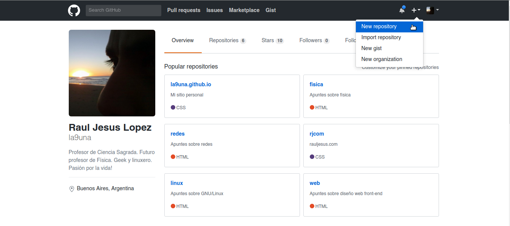
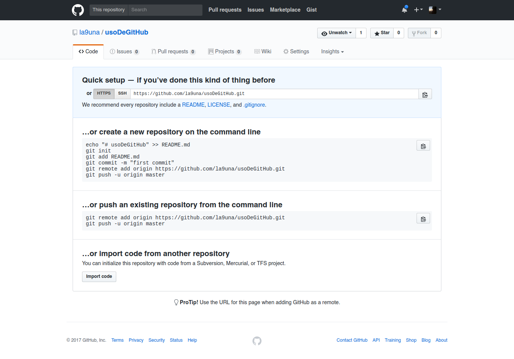

**[GitHub](https://github.com)** es una plataforma de desarrollo colaborativo de software para alojar proyectos utilizando el sistema de control de versiones **[Git](https://git-scm.com/)**.

!!!done "Servidores que soportan Git"
		GitHub no es el único servicio en línea que soporta Git. Entre los más conocidos podemos encontrar: 

		* [GitLab](https://about.gitlab.com)
		* [Bitbucket](https://bitbucket.org)

## Cómo crear un repositorio en GitHub
Procederemos a crear un repositorio público en GitHub (gratuito).

!!!done "Practicá con Git y GitHub"
		Existen muchos tutoriales en línea que explican el funcinamiento de Git y GitHub. Uno particularmente útil y sencillo podés encontrarlo en: [https://try.github.io](https://try.github.io)