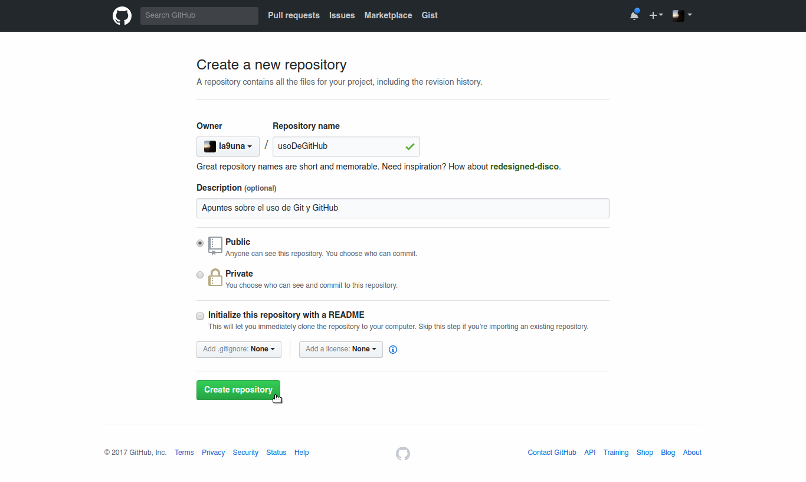

Existen varias opciones para obtener un repositorio Git remoto y ponerlo a funcionar para que puedas colaborar con otras personas o compartir tu trabajo. En líneas generales se tratará de un **servidor propio** o de un **servidor hospedado por terceros**.

En cualquier caso, es preciso determinar que solución o combinación de soluciones es apropiada para nosotros y la empresa.


## 1. Git en un servidor propio
Mantener **tu propio servidor** te da control y te permite correr tu servidor dentro de tu propio cortafuegos, pero tal servidor generalmente requiere una importante cantidad de tu tiempo para configurar y mantener. 

En líneas generales tendremos que crear un repositorio Git desnudo (_bare_) o también llamado vacío. Por convención, los directorios de repositorios desnudos o vacíos finalizan con la extensión `.git`.


### 1.1. Partiendo de un repositorio Git existente
Para configurar por primera vez un servidor de Git, hay que exportar un repositorio existente en un nuevo repositorio vacío, es decir, un repositorio que no contiene un directorio de trabajo. Esto es generalmente fácil de hacer.

En primer lugar clonamos un repositorio Git existente: 

```bash
git clone --bare miRepositorioGitExistente miNuevoRepositorio.git
```
Y luego permitimos que el repositorio sea compartido: 

```bash
git config core.sharedRepository true
```
Sin embargo, ambas órdenes se pueden ejecutar en una sola: 

```bash
git clone --bare --shared miRepositorioGitExistente miNuevoRepositorio.git
```

### 1.2. Partiendo desde de una carpeta vacía
Otra de las maneras de crear un repositorio vacío es partiendo de una carpeta vacía sobre la cual inicializaremos un repositorio Git. 

Para ello, creamos el directorio que contendrá el repositorio: 

```bash
mkdir miRepositorio.git
```
E ingresamos en él:

```bash
cd miRepositorio.git
```
E inicializamos un repositorio vacío y compartido:

```bash
git init --bare --shared
```

## 2. Git en un servidor hospedado
Si almacenas tus datos en un **servidor hospedado**, es fácil de configurar y mantener; sin embargo, tienes que ser capaz de mantener tu código en los servidores de alguien más, y algunas organizaciones no te lo permitirán.


Existen varios sitios que ofrecen un servidor Git en la nube como [GitHub](https://github.com), [GitLab](https://about.gitlab.com), [Bitbucket](https://bitbucket.org) y [Coding](https://coding.net/), entre otros. 

En líneas generales, estos sitios permiten crear de manera gratuita un número ilimitado de repositorios públicos y repositorios privados con cantidad ilimitada de colaboradores en su versión paga.

### 2.1. Cómo crear un repositorio en GitHub
Procederemos a crear un repositorio público en GitHub (gratuito). Accedemos a [https://github.com/](https://github.com/) y hacemos clic sobre la leyenda **Sign up**:


Rellenamos el formulario con los datos solicitados. Luego de hacer clic sobre el botón **Create an account** tendremos que iniciar sesión en nuestra cuenta de correo electrónico (la que suministramos al registrarnos) y hacer clic sobre el enlace que encontraremos en el mensaje de confirmación de creación de la cuenta. 


Ya dentro de la cuenta, en el menú desplegable superior seleccionaremos la opción **New repository** para crear un nuevo repositorio público (en la imagen pueden apreciarse algunos repositorios ya creados por el usuario):


Sólo restará completar los datos solicitados para la creación del repositorio y hacer clic sobre el botón **Create repository**: 



Finalmente, se nos sugerirá realizar algunas acciones para sincronizar nuestro repositorio local con el repositorio remoto, tema que discuteremos en profundidad [en otra sección](trabajandoConRemotos/#5-enviando-hacia-nuestros-repositorios-remotos): 


!!!done "Practicá con Git y GitHub"
		Existen muchos tutoriales en línea que explican el funcinamiento de Git y GitHub. Uno particularmente útil y sencillo podés encontrarlo en: [https://try.github.io](https://try.github.io)

## 3. Sincronizando repositorios
Para poder sincronizar nuestro repositorio local con un repositorio remoto tendremos que realizar algunas acciones extra que serán explicadas en detalle en la sección [Trabajando con remotos](trabajandoConRemotos/#5-enviando-hacia-nuestros-repositorios-remotos)