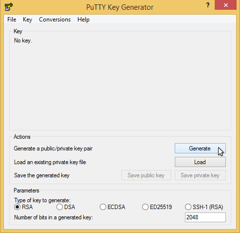
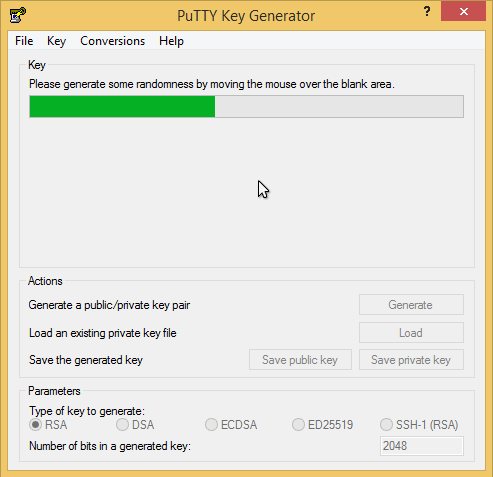
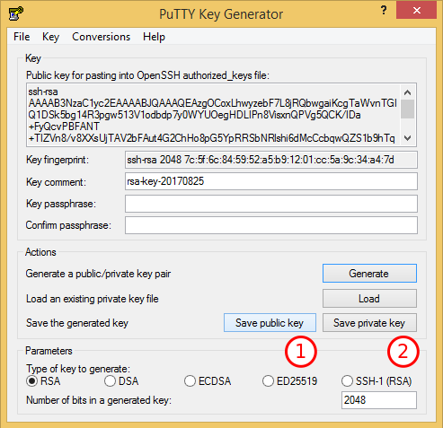

La autenticación de llave pública permite el inicio de sesión de un usuario en el servidor remoto mediante el empleo de archivos de clave, lo que aumente considerablemente la seguridad del servidor. 

A continuacipon se describen una serie de pasos que nos permitirán iniciar sesión en un servidor remoto sin utilizar contraseña. En su lugar emplearemos uno par de archivos encriptados conocidos como llave (o clave) privada y llave (o clave) pública. 


!!! tip "Glosario"
	En el presente tutorial, **máquina local** hace referencia a nuestra computadora y **servidor** al servidor remoto. 


## Generando llaves
A continuación se describe el procedimiento para generar un par de claves (pública y privada) para conectarse a un servidor GNU/Linux sin necesidad de ingresar usuario y contraseña. 


### En Microsoft Windows
En primer lugar, tendremos que descargar el programa PuttyGen: 

* [Puttygen - 32 bits](https://the.earth.li/~sgtatham/putty/latest/w32/puttygen.exe)
* [Puttygen - 64 bits](https://the.earth.li/~sgtatham/putty/latest/w64/puttygen.exe)

Abrimos el programa y veremos una interfaz similar a la siguiente: 



Hacemos clic en el botón **Generate** y acto seguido agitamos el cursor en el área blanca de la ventana del programa: 



Por último, debermos guardar la **clave pública** haciendo clic sobre el botón **Save public key** y la **clave privada** haciendo clic sobre el botón **Save private key**




### En GNU/Linux

_Logueados_ con nuestro usuario normal en la **máquina local**, ejecutamos: 

```apache
ssh-keygen
```
Aunque podemos ingresar otros valores, si presionamos la tecla _Enter_ estaremos aceptando los valores por defecto para los nombres de las llaves y su ubicación, a saber: 


| Recurso              | Tipo                | Descripción                              |
| -------------------- | ------------------- | ---------------------------------------- |
| `/home/usuario/.ssh` | Directorio (oculto) | Ubicación por defecto de los archivos de clave |
| `id_rsa`             | Archivo             | Llave privada                            |
| `id_rsa.pub`         | Archivo             | Llave pública                            |


A continuación, se nos pedirá el **ingreso de una frase de contraseña o _passphrase_** para asegurar las llaves. Podemos ingresar la contraseña o dejarla en blanco presionando la tecla _Enter_. 

!!!tip
	Si dejamos la contraseña en blanco podremos usar la llave sin introducir contraseña. Si ingresamos una contraseña necesitaremos ambas (la llave privada y la contraseña) para iniciar sesión. Asegurar las llaves con contraseña es más seguro, pero ambos métodos tienen sus usos y son más seguros que la autenticación de contraseña básica.

## Copiando la llave pública
Tendremos que copiar la clave pública en el servidor agregándola al archivo `/home/usuario/.ssh/authorized_keys` del usuario remoto. (donde deberá reemplazar `usuario` por el usuario remoto). 

### Método manual
Tendremos que iniciar sesión en el servidor con el usuario al que queremos permitir acceso mediante el uso de clave asimétrica. Ejecutamos los siguintes comandos (uno por vez):

```apache
cd
cd .ssh
vim authorized_keys
```
Una vez abierto el archivo `authorized_keys` tendremos que copiar dentro de él, el contenido de la clave pública generada en el punto anterior, vereficando que el formato de la misma sea el similar al siguiente:


```bash
ssh-rsa AAAAB3NzaC1yc2EAAAADAQABAAABAQCB007n/ww+ouN4gSLKssMxXnBOvf9LGt4L
ojG6rs6hPB09j9R/T17/x4lhJA0F3FR1rP6kYBRsWj2aThGw6HXLm9/5zytK6Ztg3RPKK+4k
Yjh6541NYsnEAZuXz0jTTyAUfrtU3Z5E003C4oxOj6H0rfIF1kKI9MAQLMdpGW1GYEIgS9Ez
Sdfd8AcCIicTDWbqLAcU4UpkaX8KyGlLwsNuuGztobF8m72ALC/nLF6JLtPofwFBlgc+myiv
O7TCUSBdLQlgMVOFq1I2uPWQOkOWQAHukEOmfjy2jctxSDBQ220ymjaNsHT4kgtZg2AYYgPq
dAv8JggJICUvax2T9va5 usuario@dominio_o_direccion_ip_servidor
```

### Método por comandos
Para que podamos iniciar sesión en el servidor remoto, ejecutamos en la **máquina local**: 

```apache
ssh-copy-id usuario_remoto@ip_del_servidor_remoto
```
Se nos pedirá la contraseña del usuario remoto. 


Ahora se puede usar la llave privada correspondiente para iniciar sesión en el servidor.

## Deshabilitando el inicio de sesión por contraseña en el servidor
Ahora que nuestro usuario puede usar las llaves SSH para iniciar sesión en el servidor remoto, podemos aumentar la seguridad del mismo desactivando la autenticación por contraseña.

!!! warning "Importante"
	Al desactivar la autenticación por contraseña tendremos que esta seguros que previamente hemos configurado la llave pública para nuestro usuario, de lo contrario, bloquearemos el ingreso de nuestro usuario al servidor.

Al desactivar el uso de la contraseña estaremos restringiendo el acceso SSH al servidor remoto únicamente a la autenticación de llave pública. Es decir, la única manera de iniciar sesión en el servidor remoto sera teniendo la llave privada en combinación con llave pública que se instaló.

Para ello, abrimos el archivo de configuración de SSH: 

```apache
sudo nano /etc/ssh/sshd_config
```

Buscamos la línea que contiene la palabra `PasswordAuthentication` y, descomentamos la línea en caso que esté comentada (borrando el caracter # al comienzo de la línea). Luego cambiamos su valor a "no". Debería verse así después de haber realizado el cambio:


```apache
PasswordAuthentication no
```

Para hacer efectivos los cambios, reiniciamos el servidor SSH: 

```bash
sudo systemctl reload sshd
```
O bien: 

```bash
sudo service sshd reload
```

!!! done "¡Listo!"
	El inicio de sesión empleando contraseña está deshabilitado. A partir de ahora, el servidor sólo es accesible mediante la autenticación de llave SSH.